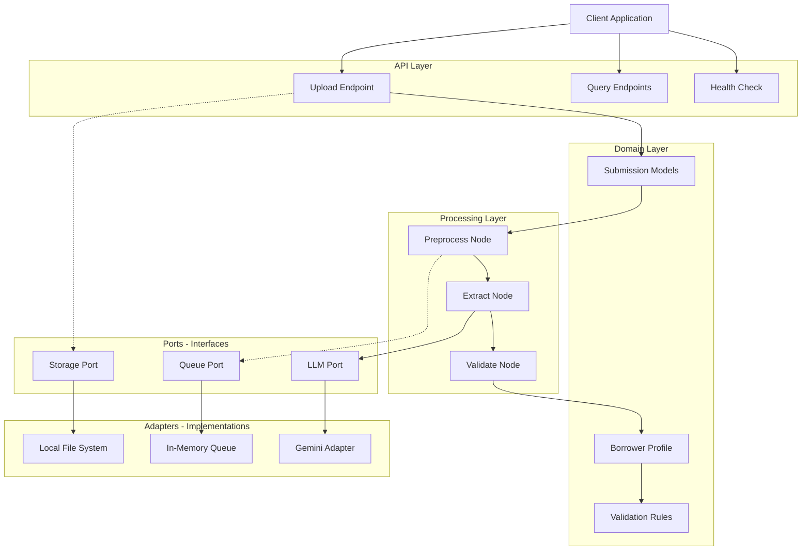

# Prompt 15: Documentation - README and System Design

## Status
[COMPLETED]

## Context
Creating the final documentation deliverables required by the assignment.

## Objective
Write comprehensive README.md and SYSTEM_DESIGN.md aligned to assignment requirements.

## Requirements

### 1. Create README.md
File: `README.md`

```markdown
# Document Extraction API

A resilient, event-driven document extraction platform for unstructured loan documents using AI/LLM technology.

## Overview

This system extracts structured borrower profiles (PII, income history, account information) from loan documents using:
- **FastAPI** for REST API
- **PydanticAI** + **Gemini** for AI-powered extraction
- **Hexagonal Architecture** for clean separation of concerns
- **Pydantic Graph** for state machine orchestration

## Quick Start

### Prerequisites
- Python 3.11+
- [uv](https://github.com/astral-sh/uv) package manager
- Gemini API key ([get one free](https://aistudio.google.com/app/apikey))

### Setup

```bash
# Clone repository
git clone <repository-url>
cd document-extraction-system

# Install dependencies
just setup

# Copy environment file
cp .env.example .env
# Edit .env and add your GEMINI_API_KEY

# Run development server
just dev
```

The API will be available at http://localhost:8000

### API Documentation

Interactive API documentation (Swagger UI) is available at:
- **Local**: http://localhost:8000/docs
- **Production**: https://<your-cloud-run-url>/docs

### Key Endpoints

| Endpoint | Method | Description |
|----------|--------|-------------|
| `/health` | GET | Health check |
| `/api/v1/upload` | POST | Upload documents for extraction |
| `/api/v1/submissions/{id}` | GET | Check submission status |
| `/api/v1/borrowers/{id}` | GET | Get extracted borrower profile |
| `/api/v1/borrowers/search` | GET | Search borrower profiles |

### Example Usage

```bash
# Upload documents
curl -X POST http://localhost:8000/api/v1/upload \
  -F "files=@loan_application.pdf" \
  -F "files=@bank_statement.pdf" \
  -F "document_type=loan_application"

# Response: {"submission_id": "abc-123", "status": "accepted"}

# Check status
curl http://localhost:8000/api/v1/submissions/abc-123

# Get borrower profile
curl http://localhost:8000/api/v1/borrowers/abc-123
```

## Environment Variables

| Variable | Required | Description |
|----------|----------|-------------|
| `GEMINI_API_KEY` | Yes | Gemini API key from Google AI Studio |
| `LOG_LEVEL` | No | Logging level (default: INFO) |
| `ENVIRONMENT` | No | Environment: local, dev, staging, production |
| `DATABASE_URL` | No | SQLite database path (default: sqlite:///./data/extraction.db) |

## Architecture

### High-Level Flow

```
Upload → Validation → Extraction → Validation → Storage → Query
   ↓         ↓            ↓            ↓          ↓        ↓
202       Check        Gemini     Logical     SQLite   Search
Accept    File         LLM        Rules       /GCS     Results
```

### Key Design Decisions

1. **Hexagonal Architecture**: Decouples business logic from infrastructure
2. **MVP with Production Path**: SQLite now, PostgreSQL + BigQuery later
3. **Event-Driven Design**: Documented for production (sync in MVP)
4. **Evaluation-Driven Development**: Golden set testing for accuracy

See [Architecture Decision Records](docs/adr/) for detailed rationale.

## Project Structure

```
.
├── src/doc_extract/          # Application code
│   ├── api/                  # FastAPI routes
│   ├── core/                 # Config, logging, exceptions
│   ├── domain/               # Pydantic models (BorrowerProfile, etc.)
│   ├── ports/                # Interface definitions (Ports)
│   ├── adapters/             # Implementations (Adapters)
│   ├── services/             # Business logic (Graph, Extraction)
│   └── utils/                # Helpers
├── tests/                    # Test suite
│   ├── integration/          # API tests
│   ├── unit/                 # Unit tests
│   └── evaluation/           # Golden set evaluation
├── infra/                    # Terraform scaffolding
├── docs/                     # Documentation
│   └── adr/                  # Architecture Decision Records
├── Dockerfile                # Container image
├── docker-compose.yml        # Local development
├── Justfile                  # Task runner (replaces Make)
└── pyproject.toml            # Dependencies
```

## Development

### Commands

```bash
just setup       # Install dependencies
just dev         # Run development server
just test        # Run tests with coverage
just lint        # Run ruff and mypy
just format      # Format code
just build-image # Build Docker image
just evaluate    # Run evaluation suite
```

### Running Tests

```bash
# All tests
just test

# With coverage report
pytest tests/ --cov=src/doc_extract --cov-report=html

# Evaluation (requires GEMINI_API_KEY)
just evaluate
```

## Production Deployment

### Infrastructure (Scaffolding)

Terraform files in `infra/` define production infrastructure:
- Cloud Run for API hosting
- GCS for document storage
- Pub/Sub for async processing
- BigQuery for analytics

See [Terraform README](infra/README.md) for deployment instructions.

### CI/CD

GitHub Actions workflows:
- **CI**: Lint, test, build on PR
- **Deploy**: Cloud Run deployment on merge to main
- **Evaluate**: Weekly accuracy evaluation

See [.github/workflows/](.github/workflows/).

## Assignment Deliverables

This repository fulfills the assignment requirements:

✅ **System Design Document**: See [SYSTEM_DESIGN.md](SYSTEM_DESIGN.md)  
✅ **Working Implementation**: Document ingestion, extraction, API, tests  
✅ **README**: Setup instructions, architectural decisions summary  

### Design Document Contents

- Architecture overview with component diagram
- Data pipeline (ingestion → processing → storage → retrieval)
- AI/LLM integration strategy (PydanticAI + Gemini)
- Format variability handling (DocumentUrl)
- Scaling considerations (10x, 100x)
- Technical trade-offs (7 ADRs)
- Error handling and data quality validation

## License

[MIT License](LICENSE)

## Contact

For questions about this implementation, refer to:
- [Architecture Decision Records](docs/adr/)
- [System Design Document](SYSTEM_DESIGN.md)
- [API Documentation](http://localhost:8000/docs) (when running)
```

### 2. Create SYSTEM_DESIGN.md
File: `SYSTEM_DESIGN.md`

```markdown
# System Design Document

## Document Extraction API

**Version:** 1.0  
**Date:** March 2025  
**Author:** Principal Engineer Candidate

---

## 1. Executive Summary

This document describes the architecture and implementation of a document extraction system that processes unstructured loan documents and produces structured borrower profiles using AI/LLM technology.

### Key Features
- **AI-Powered Extraction**: Uses Gemini LLM via PydanticAI for accurate data extraction
- **Schema-First Design**: Pydantic v2 models ensure data integrity
- **Hexagonal Architecture**: Clean separation of business logic from infrastructure
- **Production-Ready Design**: MVP with clear path to 100x scale
- **Evaluation-Driven**: Golden set testing ensures extraction accuracy

### Business Value
- Automates manual data entry from loan documents
- Reduces processing time from hours to minutes
- Provides audit trail via provenance tracking
- Enables compliance through structured validation

---

## 2. Architecture Overview

### 2.1 High-Level Architecture

```
┌─────────────────────────────────────────────────────────────────┐
│                         CLIENT                                  │
│                    (Web, Mobile, API)                           │
└──────────────────────────┬──────────────────────────────────────┘
                           │ HTTP
                           ▼
┌─────────────────────────────────────────────────────────────────┐
│                      API LAYER                                  │
│  ┌──────────────┐  ┌──────────────┐  ┌──────────────────────┐  │
│  │   Upload     │  │    Query     │  │    Health Check      │  │
│  │   Endpoint   │  │  Endpoints   │  │                      │  │
│  └──────┬───────┘  └──────┬───────┘  └──────────────────────┘  │
│         │                 │                                      │
└─────────┼─────────────────┼────────────────────────────────────┘
          │                 │
          ▼                 ▼
┌─────────────────────────────────────────────────────────────────┐
│                   DOMAIN LAYER                                  │
│  ┌──────────────┐  ┌──────────────┐  ┌──────────────────────┐  │
│  │  Submission  │  │   Borrower   │  │     Validation       │  │
│  │   Models     │  │    Profile   │  │      Rules           │  │
│  └──────────────┘  └──────────────┘  └──────────────────────┘  │
└──────────────────────────┬──────────────────────────────────────┘
                           │
                           ▼
┌─────────────────────────────────────────────────────────────────┐
│                  PROCESSING LAYER                               │
│  ┌──────────────┐  ┌──────────────┐  ┌──────────────────────┐  │
│  │  Preprocess  │──▶│   Extract    │──▶│    Validate        │  │
│  │     Node     │  │    Node      │  │      Node          │  │
│  └──────────────┘  └──────────────┘  └──────────────────────┘  │
│         │                 │                     │                 │
│         └─────────────────┴─────────────────────┘                 │
│                    Pydantic Graph State Machine                   │
└──────────────────────────┬──────────────────────────────────────┘
                           │
          ┌────────────────┼────────────────┐
          │                │                │
          ▼                ▼                ▼
┌──────────────┐  ┌──────────────┐  ┌──────────────┐
│   STORAGE    │  │    QUEUE     │  │     LLM      │
│    PORT      │  │    PORT      │  │    PORT      │
└──────┬───────┘  └──────┬───────┘  └──────┬───────┘
       │                 │                 │
       ▼                 ▼                 ▼
┌──────────────┐  ┌──────────────┐  ┌──────────────┐
│   SQLite     │  │ In-Memory    │  │    Gemini    │
│   (MVP)      │  │ Queue (MVP)  │  │  (Gemini)    │
└──────────────┘  └──────────────┘  └──────────────┘
       │                 │                 │
       └─────────────────┴─────────────────┘
                         │
                         ▼
              ┌─────────────────────┐
              │   PRODUCTION READY    │
              │   PostgreSQL + GCS    │
              │   Pub/Sub + BigQuery  │
              └─────────────────────┘
```

### 2.2 Component Diagram (Mermaid)



---

## 3. Data Pipeline Design

### 3.1 Pipeline Flow

```
┌────────────┐     ┌────────────┐     ┌────────────┐
│   CLIENT   │────▶│    API     │────▶│ VALIDATION │
└────────────┘     └────────────┘     └─────┬──────┘
                                             │
                                             ▼
┌────────────┐     ┌────────────┐     ┌────────────┐
│   RESULT   │◀────│  STORAGE   │◀────│ PROCESSING │
└────────────┘     └────────────┘     └─────┬──────┘
                                             │
        ┌────────────────────────────────────┤
        │                                    │
        ▼                                    ▼
┌────────────┐     ┌────────────┐     ┌────────────┐
│   QUERY    │◀────│  DATABASE  │◀────│   EXTRACT  │
│   RESULTS  │     │            │     │   (Gemini) │
└────────────┘     └────────────┘     └────────────┘
```

### 3.2 Data Flow Description

1. **Ingestion**
   - Client uploads PDF documents via HTTP POST
   - API validates file size, type, and content
   - Files stored with SHA-256 hash for idempotency
   - Returns 202 Accepted with submission_id

2. **Processing**
   - Preprocess Node validates file existence, password protection
   - Extract Node uses Gemini LLM via DocumentUrl
   - Validate Node applies business rules and confidence thresholds
   - State machine handles errors at each stage

3. **Storage**
   - MVP: SQLite for operational data, local filesystem for files
   - Production: PostgreSQL + GCS + BigQuery (see scaling section)

4. **Retrieval**
   - Query API provides borrower profile search
   - Provenance endpoint shows source of each field
   - Status endpoint tracks processing progress

### 3.3 Data Model

**Key Entities:**

```python
# Submission - tracks document batch
Submission {
  submission_id: string (PK)
  status: enum {pending, processing, completed, failed}
  documents: Document[]
  created_at: timestamp
  completed_at: timestamp
}

# Document - individual file metadata
Document {
  document_id: string (PK)
  file_hash: string (indexed - for idempotency)
  file_name: string
  file_size: int
  mime_type: string
  storage_path: string
}

# BorrowerProfile - extracted data
BorrowerProfile {
  borrower_id: string (PK)
  name: string
  address: Address
  income_history: IncomeEntry[]
  accounts: AccountInfo[]
  extraction_confidence: float
  source_documents: string[]
}

# All extracted fields include Provenance:
Provenance {
  source_document: string
  source_page: int
  verbatim_text: string
  confidence_score: float
  extraction_timestamp: timestamp
}
```

---

## 4. AI/LLM Integration Strategy

### 4.1 Model Selection

**Primary: Gemini via Google AI Studio**
- **Model**: gemini-2.5-pro
- **Provider**: Google Generative Language API
- **Authentication**: API key (GEMINI_API_KEY)
- **Input**: DocumentUrl (direct PDF URL)
- **Output**: Structured JSON via Pydantic

**Why Gemini?**
1. **DocumentUrl Support**: Passes PDF directly to model, no preprocessing
2. **API Key Simplicity**: Reviewer can provide their own key
3. **Cost**: Free tier available, competitive pricing
4. **Performance**: Strong document understanding

### 4.2 Integration Architecture

```
┌─────────────┐     ┌──────────────┐     ┌─────────────┐
│   Document  │────▶│  DocumentUrl │────▶│    Gemini   │
│   (PDF)     │     │  (PydanticAI)│     │     LLM     │
└─────────────┘     └──────────────┘     └──────┬────┘
                                                  │
                                                  ▼
                                          ┌─────────────┐
                                          │   Pydantic  │
                                          │   Schema    │
                                          │  Validation │
                                          └──────┬────┘
                                                 │
                                                 ▼
                                          ┌─────────────┐
                                          │  Borrower   │
                                          │   Profile   │
                                          └─────────────┘
```

### 4.3 Extraction Flow

1. **System Prompt**: Detailed instructions for loan document extraction
2. **Document Input**: DocumentUrl passes gs:// or file:// URL
3. **Structured Output**: PydanticAI enforces BorrowerProfile schema
4. **Validation**: Field-level validation (positive income, valid dates)
5. **Provenance**: Source page and text snippet for each field

### 4.4 Error Handling

| Error Type | Handling | Retry |
|------------|----------|-------|
| Rate Limit | Exponential backoff (stamina) | Yes (3x) |
| Timeout | Log + fail | Yes (3x) |
| Invalid JSON | Log + manual review | No |
| Schema Validation | Return partial results | No |

### 4.5 Cost Optimization

- **Token Logging**: Track input/output tokens per request
- **Caching**: Cache similar documents (future improvement)
- **Batching**: Process multiple pages in single request (when supported)
- **Model Cascading**: Use cheaper model for simple documents (future)

---

## 5. Handling Document Format Variability

### 5.1 Supported Formats

**MVP:**
- PDF (text-searchable and scanned)
- JSON (already structured)

**Future:**
- Images (PNG, JPG via OCR)
- Word documents (DOCX)
- Spreadsheets (XLSX)

### 5.2 Format Handling Strategy

**PDF Processing:**
```python
# Gemini DocumentUrl handles PDF automatically
# No preprocessing library needed (unlike other LLMs)
doc_url = DocumentUrl(url="gs://bucket/document.pdf")
result = await agent.run(["Extract data", doc_url])
```

**Format Detection:**
- MIME type validation on upload
- Extension checking (.pdf, .json)
- Content sniffing for type verification

**Password Protection:**
- Detect encrypted PDFs during preprocessing
- Return clear error to client
- Log for manual intervention

### 5.3 Mixed Document Processing

For submissions with multiple document types:
1. Process each document independently
2. Merge overlapping fields (highest confidence wins)
3. Flag conflicts for manual review

### 5.4 Schema Evolution

**Versioning Strategy:**
- BorrowerProfile v1: Current schema
- Future versions add fields (backward compatible)
- Migration scripts for database updates

**Field Mapping:**
- Document type detection determines extraction prompt
- Different prompts for loan apps vs bank statements
- Common schema allows unified queries

---

## 6. Scaling Considerations

### 6.1 Current Architecture (MVP)

**Capacity**: ~10 documents/minute
- Single container
- SQLite database
- Local file storage
- Synchronous processing

**Limitations:**
- No horizontal scaling
- Database lock contention
- Memory limits (file size)
- Request timeouts (long extractions)

### 6.2 10x Scaling Strategy

**Target**: 100 documents/minute

**Changes Required:**

| Component | Current | 10x Scaling |
|-----------|---------|-------------|
| **Compute** | Single container | Cloud Run (2-20 instances) |
| **Database** | SQLite | Cloud SQL PostgreSQL |
| **Storage** | Local disk | Google Cloud Storage |
| **Queue** | None | Still sync (queue later) |
| **Concurrency** | 1 | 10 requests/instance |

**Architecture:**
```
Load Balancer → Cloud Run (2-20 instances) → PostgreSQL
                    ↓
                  GCS (uploads + output)
```

**Effort**: ~8 hours to implement
- Swap SQLiteAdapter for PostgreSQLAdapter
- Configure Cloud Run with gcloud CLI
- Add connection pooling (SQLAlchemy)
- Update Docker image for Cloud Run

### 6.3 100x Scaling Strategy

**Target**: 1000+ documents/minute

**Changes Required:**

| Component | 10x | 100x Scaling |
|-----------|-----|--------------|
| **Compute** | Cloud Run API | Separate worker pool |
| **Queue** | Sync | Pub/Sub with autoscaling |
| **Database** | PostgreSQL | PostgreSQL + Read replicas |
| **Analytics** | None | BigQuery + Dataform ETL |
| **Sharding** | None | By submission_id hash |

**Architecture:**
```
Load Balancer → Cloud Run (API) → Pub/Sub → Cloud Run Workers
                                              ↓
                                     GCS + PostgreSQL + BigQuery
```

**Key Features:**
- **Pub/Sub Queue**: Decouples upload from processing
- **Worker Pool**: Autoscaling based on queue depth
- **BigQuery**: Analytics separate from operational data
- **Dataform**: ETL pipeline GCS → BigQuery

**Effort**: ~40 hours to implement
- Add PubSubAdapter implementing QueuePort
- Create separate Cloud Run worker service
- Implement Dataform ETL workflow
- Add monitoring and alerting

### 6.4 Scaling Bottlenecks

| Bottleneck | Limit | Solution |
|------------|-------|----------|
| Gemini Rate | 15 req/min (free) | Request quota increase |
| File Size | 50MB default | Chunking + streaming |
| Memory | 4GB per instance | Larger instances or streaming |
| Database | Connection limits | Pooling, read replicas |

---

## 7. Technical Trade-offs

### 7.1 Architecture Decisions Summary

| Decision | Chosen | Alternatives | Rationale |
|----------|--------|--------------|-----------|
| **Architecture** | Hexagonal (Ports/Adapters) | Layered, MVC | Testability, swappable implementations |
| **Storage (MVP)** | SQLite | PostgreSQL | Zero setup, easy demo |
| **Storage (Prod)** | PostgreSQL + BigQuery | DynamoDB, MongoDB | ACID + analytics separation |
| **Queue (MVP)** | Synchronous | Celery, RabbitMQ | Time constraint, clear upgrade path |
| **Queue (Prod)** | Pub/Sub | Kafka, SQS | GCP native, managed service |
| **LLM** | Gemini | OpenAI, Anthropic | DocumentUrl support, API key simplicity |
| **LLM Framework** | PydanticAI | LangChain, Instructor | Native Pydantic, structured output |
| **State Machine** | Pydantic Graph | Airflow, Temporal | Type-safe, async, lightweight |
| **API Framework** | FastAPI | Flask, Django | Async native, automatic docs |
| **Validation** | Pydantic v2 | Marshmallow, Cerberus | Type safety, performance |

### 7.2 Risk Assessment

| Risk | Probability | Impact | Mitigation |
|------|-------------|--------|------------|
| Gemini API unavailable | Low | High | Retry logic, fallback to mock |
| Pydantic Graph API changes | Medium | Medium | Vendor is Pydantic team, stable |
| SQLite corruption | Low | High | Backups, migration to PostgreSQL |
| Long extraction timeout | Medium | Medium | Async design, queue in production |
| Cost overruns (Gemini) | Low | Low | Token logging, alerting |

### 7.3 Technical Debt

**Acceptable for MVP:**
- Synchronous processing (queue documented)
- SQLite instead of PostgreSQL
- No caching layer
- No monitoring/alerting

**Must Address Before Production:**
- Implement queue (Pub/Sub)
- Migrate to PostgreSQL
- Add monitoring (Logfire, CloudWatch)
- Implement caching for repeated extractions
- Add rate limiting

---

## 8. Error Handling Strategy

### 8.1 Error Categories

**Validation Errors:**
- Invalid file type
- File too large
- Password-protected PDF
- Malformed JSON

**Processing Errors:**
- File not found in storage
- LLM extraction failed
- Schema validation failed
- Timeout during extraction

**Infrastructure Errors:**
- Database connection lost
- Storage service unavailable
- LLM API rate limited

### 8.2 Error Handling Approach

**Negative Space Programming:**
```python
# Fail fast with clear errors
if file_size > MAX_SIZE:
    raise ValidationError(f"File exceeds {MAX_SIZE}MB limit")

if not mime_type in ALLOWED_TYPES:
    raise ValidationError(f"Unsupported file type: {mime_type}")
```

**Graceful Degradation:**
- Non-critical failures log WARNING and continue
- Partial extraction results returned with error flags
- Manual review queue for uncertain extractions

**Retry Strategy:**
```python
@retry(on=Exception, attempts=3, timeout=60)
async def extract_with_llm(...):
    # Exponential backoff with jitter
    # 1s, 2s, 4s delays
```

### 8.3 Error Response Format

```json
{
  "error": "VALIDATION_ERROR",
  "message": "File size exceeds limit",
  "details": {
    "max_allowed": 52428800,
    "actual": 104857600
  },
  "trace_id": "abc-123-def-456"
}
```

### 8.4 Dead Letter Queue

Failed messages after max retries go to DLQ:
```python
await queue.publish_to_dlq(message, reason="Max retries exceeded")
```

DLQ monitored for manual intervention.

---

## 9. Data Quality Validation

### 9.1 Validation Strategy

**Three-Layer Validation:**
1. **Input Validation**: File size, type, schema (Pydantic)
2. **Extraction Validation**: LLM output matches schema (PydanticAI)
3. **Business Validation**: Logical rules (custom validators)

### 9.2 Business Rules

```python
# Income must be positive
@field_validator("income_history")
def validate_income(cls, v):
    for income in v:
        if income.amount <= 0:
            raise ValueError("Income must be positive")
    return v

# Dates must be chronological
@field_validator("period_end")
def validate_period(cls, end, info):
    start = info.data.get("period_start")
    if start and end <= start:
        raise ValueError("End date must be after start date")
    return end

# Confidence threshold
if extraction_confidence < 0.8:
    requires_manual_review = True
```

### 9.3 Quality Metrics

**Evaluation-Driven Development:**
- Golden set of documents with ground truth
- Precision, Recall, F1 scores calculated
- Weekly evaluation runs in CI
- Alert if F1 drops below 80%

**Confidence Scoring:**
- Per-field confidence from LLM
- Overall confidence calculated from fields
- Low confidence flags for manual review

### 9.4 Provenance Tracking

Every extracted field includes:
- Source document ID
- Page number
- Verbatim text snippet
- Extraction timestamp
- Confidence score

**Purpose:** Audit trail, error investigation, compliance

---

## 10. Security Considerations

### 10.1 PII Handling

**Data Protection:**
- SSN stored as last 4 digits only
- PII encrypted at rest (in production)
- Access logging for audit trails
- Data retention policies (TBD)

### 10.2 API Security

**Authentication:**
- API keys for service-to-service (future)
- JWT tokens for user authentication (future)
- For MVP: No auth (documented as limitation)

**Authorization:**
- Role-based access control (future)
- Principle of least privilege for service accounts

### 10.3 Infrastructure Security

**Cloud Run:**
- Service account with minimal permissions
- VPC connector for private network access (future)
- HTTPS only

**GCS:**
- Signed URLs for temporary access
- Bucket IAM policies
- Lifecycle policies for data retention

**Secret Management:**
- Gemini API key in environment variable (MVP)
- Google Secret Manager (production)
- No secrets in code or logs

---

## 11. Future Improvements

### 11.1 Near Term (Post-MVP)

1. **Pub/Sub Queue**: Async processing for scale
2. **PostgreSQL Migration**: Production database
3. **Monitoring**: Logfire, CloudWatch, alerting
4. **Caching**: Redis for repeated extractions
5. **Rate Limiting**: Prevent abuse

### 11.2 Medium Term

1. **OCR Integration**: Support scanned images
2. **Model Cascading**: Cheaper model for simple docs
3. **Batch Processing**: Multiple documents efficiently
4. **Human-in-the-Loop**: Review UI for uncertain extractions
5. **Multi-tenancy**: Separate data by customer

### 11.3 Long Term

1. **Custom Model Training**: Fine-tuned for specific document types
2. **Real-time Processing**: Stream processing for high volume
3. **Global Deployment**: Multi-region for latency
4. **Compliance**: SOC2, HIPAA, GDPR certification

---

## 12. Conclusion

This document extraction system demonstrates:
- **Modern Architecture**: Hexagonal pattern, clean code
- **AI Integration**: PydanticAI + Gemini for structured extraction
- **Scalability**: Clear path from MVP to 100x production scale
- **Quality**: Evaluation-driven development with provenance tracking
- **Maintainability**: Comprehensive documentation, ADRs, tests

The implementation balances MVP pragmatism with production-ready design, proving both immediate value and long-term scalability.

---

## Appendix A: Technology Stack

| Component | Technology | Version |
|-----------|-----------|---------|
| Language | Python | 3.11+ |
| API Framework | FastAPI | 0.115+ |
| Validation | Pydantic | 2.10+ |
| AI Framework | PydanticAI | 0.0.20+ |
| State Machine | Pydantic Graph | 0.0.20+ |
| Database (MVP) | SQLite | 3.39+ |
| Database (Prod) | PostgreSQL | 15+ |
| Queue (Prod) | Google Pub/Sub | N/A |
| Storage (Prod) | Google Cloud Storage | N/A |
| Analytics | BigQuery | N/A |
| Deployment | Cloud Run | N/A |
| CI/CD | GitHub Actions | N/A |
| IaC | Terraform | 1.7+ |

## Appendix B: Reference Documents

- [Architecture Decision Records](docs/adr/)
- [API Documentation](http://localhost:8000/docs) (when running)
- [README](README.md) - Setup and usage
- [Justfile](Justfile) - Development commands
```

## Deliverables
- [ ] README.md with quick start and API usage
- [ ] SYSTEM_DESIGN.md covering all assignment requirements
- [ ] Component diagrams (ASCII and Mermaid)
- [ ] Data pipeline description
- [ ] AI/LLM integration strategy
- [ ] Scaling plans for 10x and 100x
- [ ] Error handling strategy
- [ ] Data quality validation approach
- [ ] Architecture decision summary tables

## Success Criteria
- README enables setup in <10 minutes
- SYSTEM_DESIGN.md covers all 7 assignment deliverable sections
- Component diagrams show system architecture
- Scaling sections have concrete numbers (instances, capacity)
- All technical trade-offs justified with comparison tables
- Document is professional and interview-ready

## Completion Checklist

All 15 implementation prompts are now complete:

1. ✅ 01_project_setup.md - Dependencies and tooling
2. ✅ 02_project_scaffold.md - Docker and basic structure
3. ✅ 03_domain_models.md - Pydantic schemas
4. ✅ 04_ports_interfaces.md - Hexagonal architecture ports
5. ✅ 05_adapters_local.md - Local implementations
6. ✅ 06_adapters_production.md - Cloud scaffolding
7. ✅ 07_api_endpoints.md - FastAPI routes
8. ✅ 08_processing_graph.md - Pydantic Graph state machine
9. ✅ 09_ai_extraction.md - PydanticAI agent
10. ✅ 10_storage_and_db.md - Persistence layer
11. ✅ 11_tests_and_eval.md - Evaluation framework
12. ✅ 12_terraform_scaffold.md - Infrastructure as code
13. ✅ 13_cicd_workflows.md - GitHub Actions
14. ✅ 14_adrs.md - Architecture Decision Records
15. ✅ 15_documentation.md - README and SYSTEM_DESIGN.md

**Implementation plan is complete and ready for execution.**
